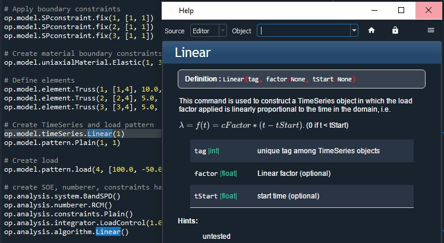

# OpenSeesPyHints
A wrapper around the OpenSeesPy libray that contains docstrings and easier function calls.
All commands can be mixed with basic OpenSeesPy commands.


<p align="center">
  
</p>

# a basic example:
```Python
import openseespyhint as op
import openseespy.opensees as ops

# Delete any old opensees objects
op.utility.wipe()
    
# Create the Basic Model
op.model.basic(2, 2)

# Create Nodes
op.model.node(1, [0.0, 0.0])
op.model.node(2, [144.0,  0.0])
op.model.node(3, [168.0,  0.0])
op.model.node(4, [72.0, 96.0])

# Apply boundary constraints
op.model.SPconstraint.fix(1, [1, 1])
op.model.SPconstraint.fix(2, [1, 1])
op.model.SPconstraint.fix(3, [1, 1])

# Create material boundary constraints
op.model.uniaxialMaterial.Elastic(1, 3000.0)    

# Define elements
op.model.element.Truss(1, [1,4], 10.0, 1)
op.model.element.Truss(2, [2,4], 5.0, 1)
op.model.element.Truss(3, [3,4], 5.0, 1)
   
# Create TimeSeries and load pattern
op.model.timeSeries.Linear(1)
op.model.pattern.Plain(1, 1)

# Create load
op.model.pattern.load(4, [100.0, -50.0])

# create SOE, numberer, constraints handler, integrator, and algorithm
op.analysis.system.BandSPD()
op.analysis.numberer.RCM()
op.analysis.constraints.Plain()
op.analysis.integrator.LoadControl(1.0)
op.analysis.algorithm.Linear()

# create analysis object
op.analysis.analysis('Static')

# perform the analysis
ops.analyze(1)

# get outputs    
ux = ops.nodeDisp(4,1)
uy = ops.nodeDisp(4,2)  
    
if abs(ux-0.53009277713228375450)<1e-12 and abs(uy+0.17789363846931768864)<1e-12:
    print("Passed!")
else:
    print("Failed!")   

```

Currently being built and tested. The build status of commands is as follows:

## model
 - []   element (in progress)
 - [x]   node
 - [x]   SP_Constraint
 - []   mp_constraint
 - [x]   pc
 - [x]   timeSeries
 - [x]   pattern
 - [x]   mass
 - [x]   region
 - [x]   reyleigh
 - [x]   block
 - [x]   beamIntegration
 - []   uniaxialMaterial (in progress)
 - []   ndMaterial (in progress)
 - [x]   section
 - [x]   frictionModel
 - [x]   geomTransf

## [x] Analysis
## [] Ouput
## [x] Utility
## [] FSI
## [] Sensitivity
## [] Relieability
## [] Parallel

Once built, commands should be tested and compared to their original OpenSeesPy counterpart.
Commands untested are labeled as such.


